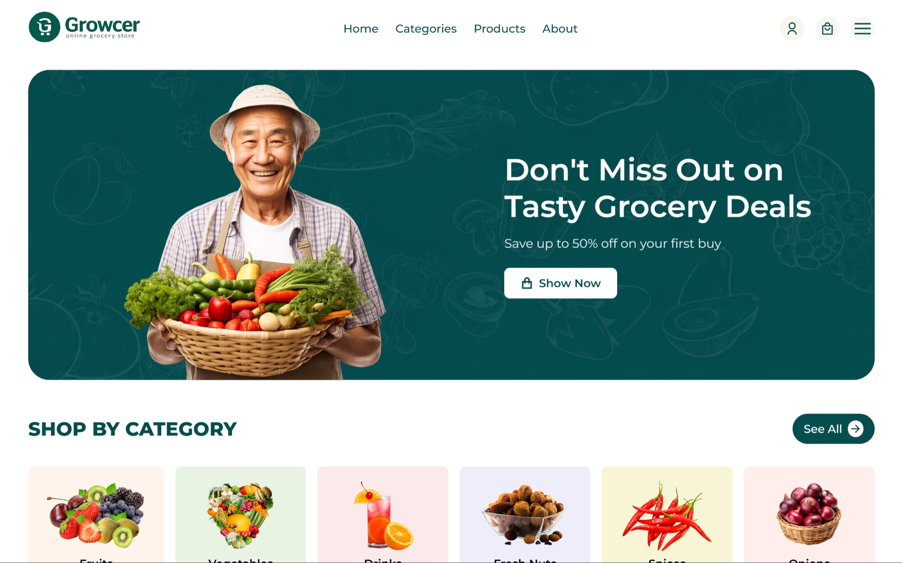

# Grocery Shop

---

## 📌 Overview

<div align="center">
<a href="https://grocery-shop-krb.netlify.app/" target="_blank">
  
</a>
</div>

<p align="center">
  <a href="https://grocery-shop-krb.netlify.app/">
    
  </a>
</p>

A responsive grocery e-commerce landing page built with HTML, CSS, and JavaScript. The project focuses on layout design, component structuring, and interactive UI behavior.

## ✨ Features

- Fully responsive design (mobile, tablet, desktop)
- Sticky navigation bar with mobile menu toggle
- Hero section with promotional content
- Category grid layout
- Product listing with badges (Hot, New, Discount, Out of Stock)
- Promotional banner sections
- Footer with company and contact information
- Scroll animations for improved UI experience

---

## 🛠️ Tech Stack

- HTML5 (semantic structure)
- CSS3 (Flexbox, Grid, variables, media queries)
- JavaScript (DOM manipulation, menu toggle)
- ScrollReveal (animation library)

---

## 📁 Folder Structure

```bash
grocery-shop/
├── index.html
├── styles.css
├── script.js
└── images/
```

---

## 📦 Installation & Run

Follow these steps to set up and run the project:

```bash
# Clone the repository
git clone https://github.com/krowey-richmond/grocery-shop.git

# Move into the project folder
cd grocery-shop

# Open in VS Code
code .
```

If it runs in the browser:

- Open `index.html` directly

---

## 📊 Project Status

- Status: Completed
- Version: 1.0

---

## 🧠 What I Learned

- Building large multi-section layouts
- Managing complex CSS structures
- Creating reusable UI components
- Handling mobile navigation with JavaScript
- Using third-party animation libraries
- Improving UI responsiveness across breakpoints


## Notes

This is a frontend-only project. All product data is static and used for UI demonstration purposes only.
